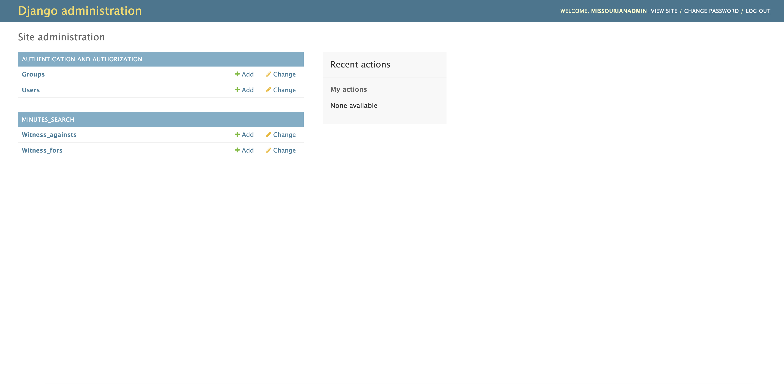
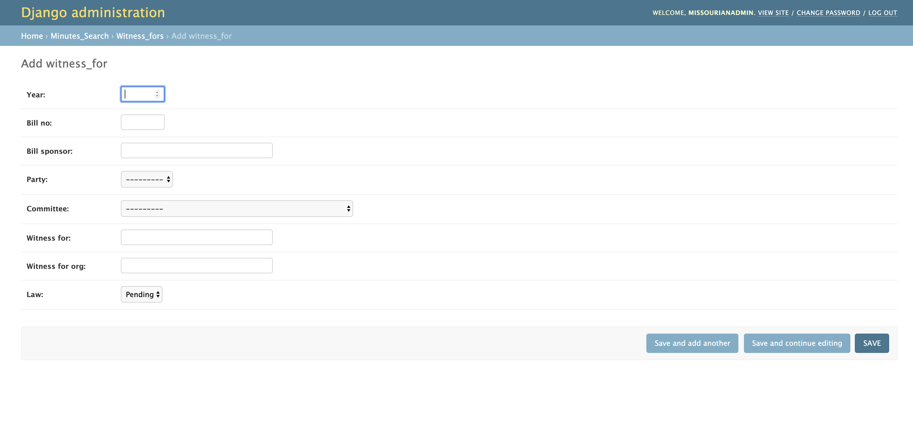
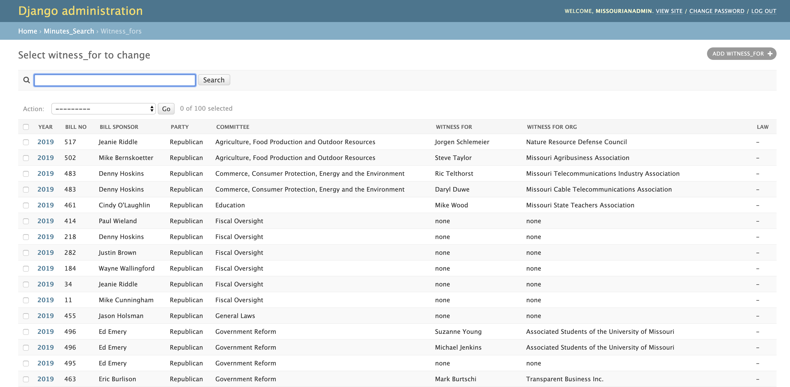

# Missouri Senate Minutes Project guide
Welcome! If you're reading this, it's because you've been tasked with the important job of maintaining the data kept in The Missouri Senate Minutes Project. This is a guide to help you get around the Django admin interface that powers our site. I'll walk you through everything you need to know about the project.  
## 1. Logging in
To do this, you'll need to get the URL, username and password from Mark. When you log in the webpage should prompt you for both a username and password. 
## 2. Adding Witnesses
When you log in you should see a screen that looks like this: 

To add a witness, click on the add button. This will take you to a screen that looks like this:

Fill in the information for each witness on the committee minutes page. If there are multiple witnesses, you can use the "Save and add another button". If there are no witnesses testifying against a particular bill, be sure to add a record with "none" for the "Witness" and "Witness org fields". 

## 3. Editing witnesses

Let's say you mess up and need to edit a record. Or you need to change whether a bill became a law. If you click on the table, it should pull up a view that looks like this: 

You can search for specific bill numbers and edit the records from there. 

## 4. Deleting witnesses

On the list view, you'll see a checkbox on the far left (see above to see what I'm talking about). Click on the records that you'd like to delete, and then go to the dropdown and pick "Delete selected witnesses." This will delete selected records. 

## Additional questions

If any of this doesn't make sense, let me know at thomas.t.oide@gmail.com. 
